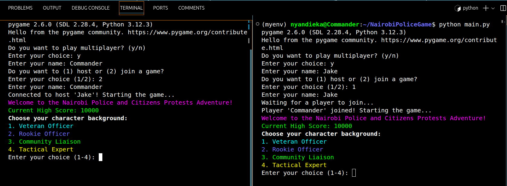

# Nairobi Police and Citizens Protests Adventure

Welcome to the Nairobi Police and Citizens Protests Adventure! This immersive text-based simulation game puts you in the shoes of a police officer in Nairobi. Your mission is to manage resources, respond to various events, and make critical decisions while balancing public support, personnel morale, and ethical considerations.

## Table of Contents

1. [Overview](#overview)
2. [Game Features](#game-features)
3. [Installation](#installation)
4. [How to Play](#how-to-play)
5. [Controls](#controls)
6. [Game Scenarios](#game-scenarios)
7. [Unethical Choices and Consequences](#unethical-choices-and-consequences)
8. [Multiplayer Mode](#multiplayer-mode)
9. [Contributing](#contributing)
10. [License](#license)

## Overview

Nairobi Police and Citizens Protests Adventure is a strategic decision-making game set in Nairobi, Kenya. As a police officer, you are responsible for managing a crisis, maintaining public order, and upholding the law. The game challenges you to make tough choices that affect various resources, including personnel, equipment, public support, and morale. The outcomes of your decisions can lead to success or failure, and making unethical choices can result in an immediate game over.

## Game Features

- **Character Selection**: Start by choosing a character from four distinct backgrounds—Veteran Officer, Rookie Officer, Community Liaison, or Tactical Expert. Each character comes with unique strengths and weaknesses that will influence your decision-making process.
- **Dynamic Events**: Experience a wide range of scenarios, such as protests, media scrutiny, natural disasters, and political interference. Each event requires thoughtful decision-making and strategic planning.
- **Resource Management**: Manage your resources effectively. Balance the allocation of personnel, equipment, public support, and morale to maintain stability and avoid a game over.
- **Ethical Decisions**: Make ethical choices to ensure the safety and well-being of the public. Unethical actions can lead to severe consequences, including ending the game prematurely.
- **Multiplayer Option**: Play with a friend in multiplayer mode, either by hosting a game or joining one.

## Installation

To play Nairobi Police and Citizens Protests Adventure, follow these steps to set up your environment and install the necessary dependencies.

### Prerequisites

- **Python**: Ensure you have Python 3.6 or higher installed.
- **pip**: The Python package installer, which is used to install the game's dependencies.

### Step 1: Clone the Repository

Clone the game's repository from GitHub:

```bash
git clone https://github.com/yourusername/nairobi-police-game.git
cd nairobi-police-game
```

### Step 2: Set Up a Virtual Environment

Create a virtual environment to manage dependencies and avoid conflicts:

```bash
python -m venv myenv
source myenv/bin/activate  # On Windows, use `myenv\Scripts\activate`
```

### Step 3: Install Dependencies

Install the required Python packages using the `requirements.txt` file:

```bash
pip install -r requirements.txt
```

### Step 4: Run the Game

Start the game by running the `main.py` file:

```bash
python main.py
```

## How to Play

1. **Launch the Game**: Start the game and choose whether to play in single-player or multiplayer mode.
2. **Character Selection**: Select a character background. Your choice affects your strengths and weaknesses, influencing the game's events.
3. **Respond to Events**: Navigate through various scenarios by making decisions. Your choices will impact your resources and the overall outcome of the game.
4. **Manage Resources**: Keep track of your resources, such as personnel, equipment, public support, and morale. Make strategic decisions to maintain balance and avoid a game over.
5. **Make Ethical Choices**: Choose your actions wisely. Unethical choices may lead to immediate negative consequences, including ending the game.

## Controls

- **'h'**: View help information at any time.
- **'q'**: Quit the game immediately.
- **Numerical Inputs**: Make decisions by selecting options corresponding to numbers displayed during scenarios.

## Game Scenarios

Throughout the game, you'll encounter a variety of scenarios, including but not limited to:

- **Protests and Demonstrations**: Manage public gatherings and maintain order without resorting to excessive force.
- **Media Scrutiny**: Handle the media's portrayal of police actions and manage public relations.
- **Natural Disasters**: Respond to crises such as floods or earthquakes, balancing resources and public safety.
- **Political Interference**: Navigate political challenges and make decisions that uphold justice and public trust.

## Unethical Choices and Consequences  (Not yet implemented)

The game includes certain choices that are deemed unethical. These choices are clearly marked during decision-making scenarios. Selecting these options can result in an immediate game over, accompanied by an explanation of why the choice was inappropriate. This feature aims to educate players about the importance of ethical decision-making in law enforcement and public service.

## Multiplayer Mode

In multiplayer mode, two players can either host or join a game. Upon starting a multiplayer session, players can:

- **Host a Game**: One player sets up the game server, and others can join.
- **Join a Game**: Connect to a game hosted by another player.
- **Multiplayer Communication**: Players can see the decisions made by their partners and collaborate on strategies.

## Contributing

We welcome contributions to Nairobi Police and Citizens Protests Adventure! If you have suggestions for new features, improvements, or bug fixes, please fork the repository and submit a pull request. Make sure to follow our coding standards and guidelines.

## License

This game is licensed under the MIT License. For more details, see the [LICENSE](LICENSE) file.

---

Thank you for playing Nairobi Police and Citizens Protests Adventure! Your feedback is valuable to us. If you encounter any issues or have suggestions, please contact us through our GitHub repository.

Enjoy the game, and remember to always prioritize ethical and humane actions in your decisions!